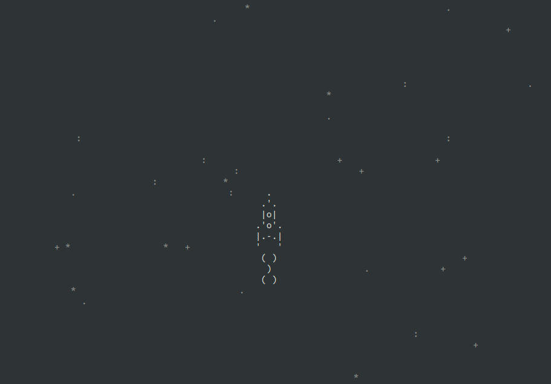

# Asyncio spaceship 
[](https://www.python.org/)
## Description
This is a retro spaceship game. At first we taught him to just fly. Soon we will teach him to shoot in the name of the emperor =)
## How to install
Python3 should be already installed.

- Clone project from [github.com](https://github.com)
```shell
git clone https://github.com/toshiharu13/asinco_python.git
```

## in order to starting game
in project folder type
```shell
python3 main.py
```


## Goal of project
The code is written for educational purposes in development courses [DevMan](https://dvmn.org).
